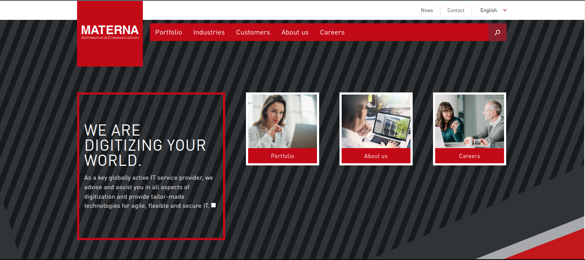

#

# Project: Materna Clone

A clone of the official https://www.materna.com/ home page design using tailwindcss library...
# Screenshot

<table align="center">
 <tr>
  <td>
   
  </td>
   <td>
   
  </td>
 </tr>
</table>
## Built With

- HTML
- CSS
- tailwindCSS
- vite

## Getting Started

)

## Prerequisites

### Setup
[-] Clone the repository:

    $ git clone https://github.com/Bateyjosue/materna-clone-tailwind.git`

[-] Navigate into the project folder

    $ cd materna-clone-tailwind

[-] Install dependencies of the project using `npm` package manager

    $ npm i || npm install

[-] Run the project 

    $ npm run dev

After the server is runned open your brower and browse to the following address: 

    http://localhost:5173/

### Live Demo
 > [Live demo](https://materna-jb.netlify.app/)

## Authors

👤 **Author**

- GitHub: [Bateyjosue](https://github.com/Bateyjosue)
- Twitter: [bateyjosue](https://twitter.com/JosueBatey)
- LinkedIn: [bateujosue](https://linkedin.com/in/josuebatey)
## Acknowledgement
    To : The Gym x Ojemba Team

    coach: @mutesialine
    

## 🤝 Contributing

  Contributions, issues, and feature requests are welcome!

  Feel free to check the [issues page](../../issues/).

## Show your support

Give a ⭐️ if you like this project!

## 📝 License

[Josh Batey](/LICENSE) Licensed